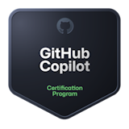

## 👋 Introduction

Hi guys, I'm **Tessa Vos**. I am a software developer from the Netherlands. I have special interest in AI and game development. Feel free to contact me if you have same interests or some questions!

## 📫 Contact me on Social Media

[LinkedIn](https://www.linkedin.com/in/tessa-vos/) | [Email](mailto:helloitstessa@outlook.com)

## 💡 Highlighted GitHub projects
- [**Wase Engine**](https://github.com/Wase-Engine): An open source 2D game engine written in C++.
- [**Wase ECS**](https://github.com/Wase-Engine/wase-ecs): An entity component system written in C++.
- [**OpenGL Framework**](https://github.com/TessaVos/opengl-framework) A basic framework that can be used to experiment with OpenGL.
- [**Threadpool**](https://github.com/TessaVos/threadpool) A C++17 header-only threadpool library.

## 🎓 GitHub Certifications

 
## 💻 Open Source Work Stats

